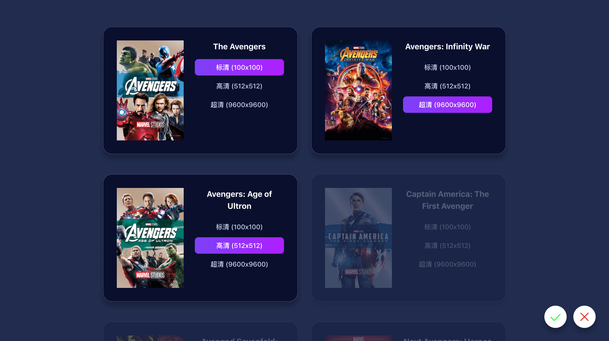

# iTunes Artwork Finder




基于 [iTunes Search API](https://affiliate.itunes.apple.com/resources/documentation/itunes-store-web-service-search-api/)、[Egg.js](https://eggjs.org) 和 [Nuxt.js](https://zh.nuxtjs.org) 开发。  
设计灵感来自 [Design Code](https://designcode.io) 网站。

## 主要功能

- 📺 下载高清影视剧海报 - 追剧党
- 🎵 下载高清音乐专辑封面 - 音乐达人
- 📱 下载高清 App 图标 - 产品爱好者

## 附加功能

- 可切换不同国家及地区
- 可任意选择分辨率下载
- 批量下载
- 主题切换
- 中英文语言

## 部署

```bash
# install dependencies
$ yarn

# serve with hot reload at localhost:3000/itunes/
$ yarn run dev

# build for production and launch server
$ yarn run build
$ pm2 start npm --name "jayyan.net-itunes" -- start
```

## 打赏项目

如果您支持这个项目，或是希望提供赞助，欢迎您给予一定的现金打赏，这些费用我将用于升级服务器配置，并开发出更多更实用的功能。


